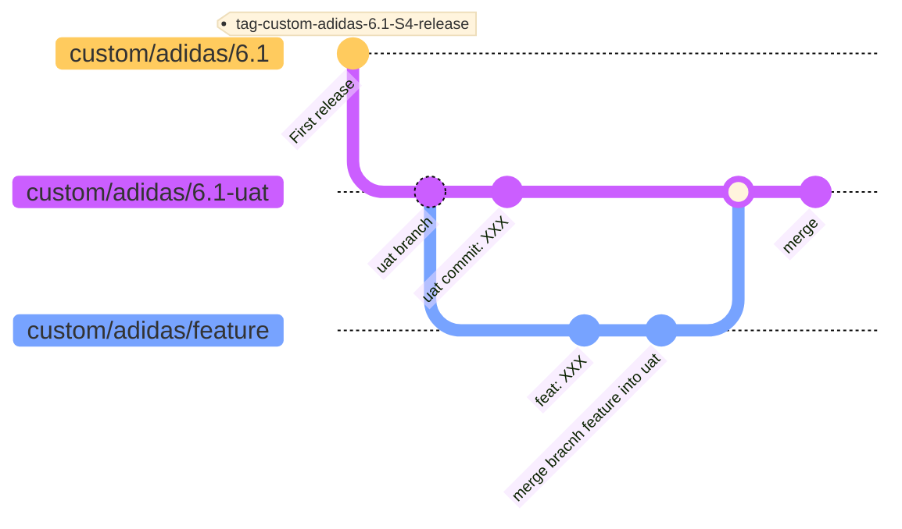

```mermaid
%%{init: { 'theme': 'base', 'gitGraph': {'showBranches': true, 'showCommitLabel':true,'mainBranchName': 'custom/adidas/6.1'}} }%%
      gitGraph
        commit id:"First release" tag: "tag-custom-adidas-6.1-S4-release"
        branch custom/adidas/6.1-uat
        checkout custom/adidas/6.1-uat
        commit id:"uat branch"
        branch custom/adidas/feature
        checkout custom/adidas/6.1-uat
        commit id:"uat commit: XXX"
        checkout custom/adidas/feature
        commit id:"feat: XXX"
        commit id:"merge bracnh feature into uat"
        checkout custom/adidas/6.1-uat
        merge custom/adidas/feature
        commit id:"merge"
        
        


```